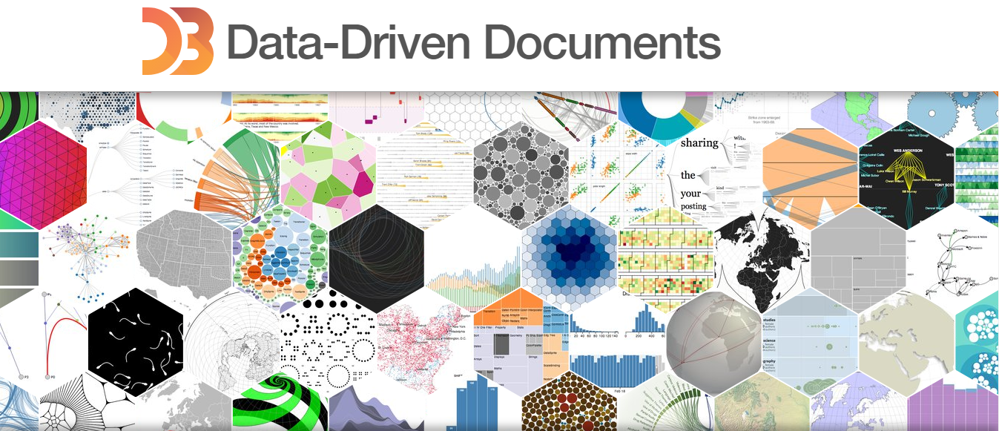

# Learning Data Visualization with D3JS Library
This is some data vizualization simple project from the Course [Data Visualization Course 2018 of Curran Kelleher](https://www.youtube.com/playlist?list=PL9yYRbwpkykvOXrZumtZWbuaXWHvjD8gi)

## Some Concepts learned
- `SVG`
- `Method chaining` with JS
- `Search data`, `Scrape webpage` with bs4 (python),
- `Cleaning the data` using only JS
- ES6 `Promises`, `arrow function`

## Table of contents

1. [x] [Starting with SVG](https://richardbmk.github.io/dataViz_d3js/00_svg_homework)
2. [x] [Let's make a face](https://richardbmk.github.io/dataViz_d3js/01_smileyFace_homework)
3. [x] [Static Barchart](https://richardbmk.github.io/dataViz_d3js/02_barchart_homework)
4. [x] [Line Chart](https://richardbmk.github.io/dataViz_d3js/03_linearchart_homework)
5. [x] [Scatter Plot](https://richardbmk.github.io/dataViz_d3js/04_scatterplot_homework)
6. [x] [Area Chart](https://richardbmk.github.io/dataViz_d3js/05_areachart_homework)
7. [x] [General Update Patter](https://richardbmk.github.io/dataViz_d3js/06_GeneralUpdatePattern)
8. [x] [Word Map](https://richardbmk.github.io/dataViz_d3js/07_WordMap)

